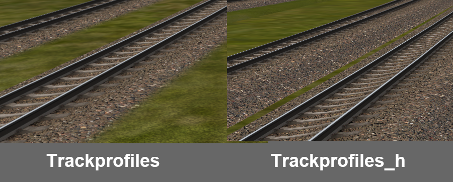

# DBTracks STF Profiles
These track profiles allow use of the super-elevation feature in Open Rails together with Norbert Rieger's DBTracks. They mimic the original DBTracks shapes as best as possible.

If you wish to replace dynamic tracks within a route and/or generate new track shapes, you should instead use the DPP profiles provided by Norbert with Dynatrax.

## Installation
This repository only contains the track profiles. The textures can be obtained from the [DBTracks package](https://the-train.de/downloads/entry/11252-dbtracks/).

If you ever need these profiles for super-elevation the textures most likely are in the route already.

**NOTE:** Use of multiple profiles is only supported from testing version _T1.5.1-1390_ onwards.

### Open Rails testing version _T1.5.1-1390_ onwards:
1. Download and extract the [latest release](https://github.com/pgroenbaek/dbtracks-stf-profiles/releases).

2. Copy all the track profiles from either the `TrackProfiles` folder or the `TrackProfiles_h` folder. These are mutually exclusive so only pick one.

   See the [Usage section](#choosing-between-trackprofiles-and-trackprofiles_h) for which to choose. If in doubt then pick `TrackProfiles_h`.

3. Place all of them into the `<route folder>/TrackProfiles` folder.

Open Rails will now automatically generate super-elevated track based on the type of DBTracks sections used in the route.

## Usage
The profiles are already configured to match DBTracks variant based on the `DB` and `V4hs` prefixes of the shape file names.

If you have track shapes named anything else, additional match conditions can be added using the `IncludeShapes` parameter within each track profile file. You can also use the `ExcludedShapes` parameter if necessary.

### Choosing between Trackprofiles and Trackprofiles_h:
There are two versions of the DBTracks profiles. The default version named `Trackprofiles` and a version with extra embankments similar to the h variants of USTracks named `Trackprofiles_h`.

The `Trackprofiles_h` version generally looks better with super-elevated track so you might want to use that.

The image below shows the difference between the two versions. One side of the default version sometimes floats in the air while `Trackprofiles_h` never does.

### About Dynatrax generated track sections:
Per default dynatrax generated tracks sections are not super-elevated properly unless additional TrackSection and TrackShape entries are added to the tsection.dat. The best way to do this is using a [route-specific tsection.dat extension](https://open-rails.readthedocs.io/en/latest/features-route.html#route-specific-tracksections-and-trackshapes).

This can be very time-consuming to create by hand if there are many Dynatrax generated track sections in the route.

A fast way to create the extra tsection.dat for your route is using this [python script](https://github.com/pgroenbaek/dbtracks-stf-profiles/blob/master/Scripts/generate_route_tsection.py). It will look through the world files and your local tsection.dat, and then create the extension tsection.dat with all the extra entries needed. The script needs to be configured with the correct paths but otherwise it is capable of creating the file for any route.

To use a specific track variant for a Dynatrax generated track section you can rename the shape file name to include the DBTracks prefix. For example from `Dynatrax-40892.s` to `DB2f_Dynatrax-40892.s`.

### Further documentation:
More details on how to use these track profiles is available in the [Open Rails documentation](https://open-rails.readthedocs.io/en/latest/options.html#superelevation). 

More information about the technical aspects of STF track profiles in Open Rails is available in [this document](https://static.openrails.org/files/OpenRails-Testing-How%20to%20Provide%20Track%20Profiles%20for%20Open%20Rails%20Dynamic%20Track.pdf).

## Track Variants

| DBTracks package  | Variants to do                                   | Variants done |
|-------------------|--------------------------------------------------|---------------|
| DB1               |                      | DB1, DB1b, DB1f, DB1fb, DB1s, DB1sh, DB1sh_lft, DB1z        |
| DB10              |                                     | DB10, DB10f, DB10fb          |
| DB11              |                                     | DB11, DB11f, DB11fb          |
| DB2               |                         | DB2, DB2b, DB2br, DB2f, DB2fb, DB2fbr, DB2s, DB2sh, DB2sh_lft, DB2z   |
| DB20              |                            | DB20, DB20b, DB20f, DB20fb, DB20z         |
| DB21              |                              | DB21, DB21b, DB21f, DB21fb           |
| DB22              |                              | DB22, DB22b, DB22f, DB22fb          |
| DB23              |                      | DB23, DB23b, DB23f, DB23fb, DB23sh, DB23sh_lft          |
| DB3               |                   | DB3, DB3b, DB3br, DB3f, DB3fb, DB3fbr, DB3sh, DB3sh_lft           |
| DB30              |                              | DB30, DB30b, DB30f, DB30fb          |
| DB4               |                                 | DB4, DB4b, DB4f, DB4fb           |
| DB40              |                              | DB40, DB40b, DB40f, DB40fb          |
| DB5               |                                 | DB5, DB5b, DB5f, DB5fb           |
| DB50              |                              | DB50, DB50b, DB50f, DB50fb          |
| DB51              |                              | DB51, DB51b, DB51f, DB51fb          |
| DB52              |                              | DB52, DB52b, DB52f, DB52fb          |
| DB501             |                           | DB501, DB501b, DB501f, DB501fb         |
| DB502             |                           | DB502, DB502b, DB502f, DB502fb         |
| DR2               |                                 | DR2, DR2b, DR2f, DR2fb           |
| DR20              |                                             | DR20, DR20b, DR20f, DR20fb          |
| V4hs              |                      | V4hs_DB1, V4hs_R2k, V4hs_RKL              |

If anything is missing, feel free to suggest more by creating an issue.

## Known issues

- There is no good way to place objects at an interval along the generated track with STF profiles. For example the following is missing from super-elevated track:
	- Connectors between the two overhead wires in f-variants.
	- Supports for the 3rd rail in sh-variants.
- Dynatrax generated track sections are not super-elevated properly unless you add additional TrackSection and TrackShape entries to tsection.dat. How to do this is discussed in the [Usage section](#about-dynatrax-generated-track-sections).
- Textures are not yet properly mapped to the 3rd rail in sh variants, this will be fixed eventually. If you want to have a go at doing the texture mapping properly, feel free to do so and submit a pull request with it.

Create an issue or pull request if you find more.

## License

These track profiles were configured by Peter Grønbæk Andersen based on Norbert Rieger's original work on DBTracks.

The profiles are licensed under [CC BY-NC-SA 4.0](https://creativecommons.org/licenses/by-nc-sa/4.0/).

## Acknowledgements

In memory of Norbert Rieger.

All credit goes to Norbert as he is the author of the original DBTracks shapes.